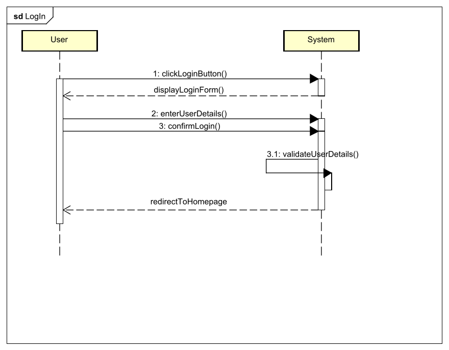
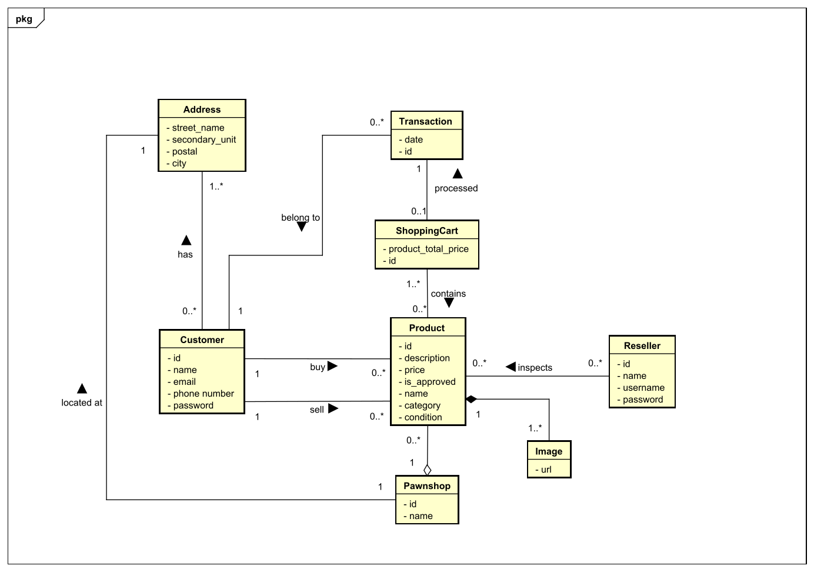
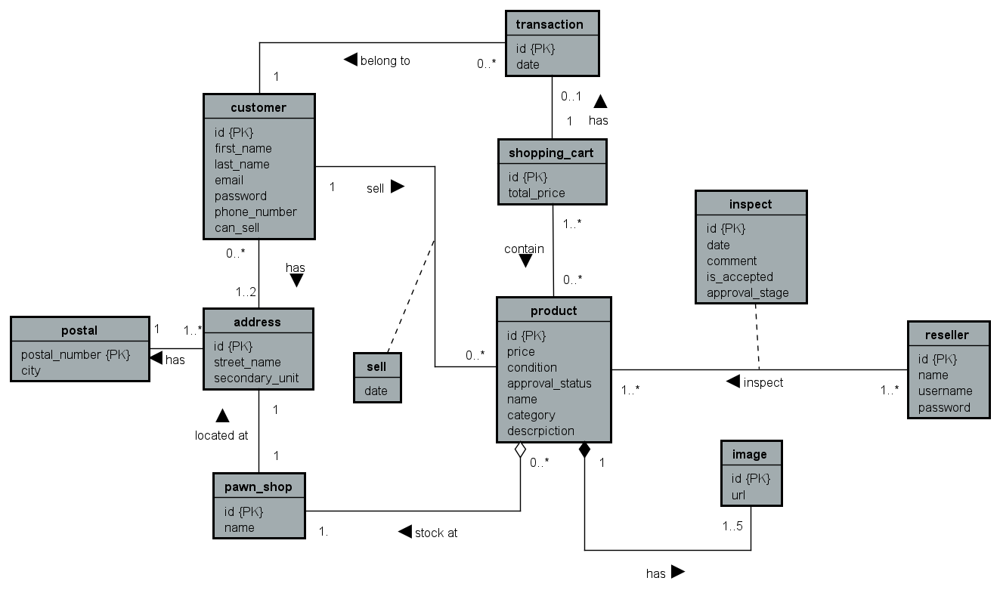
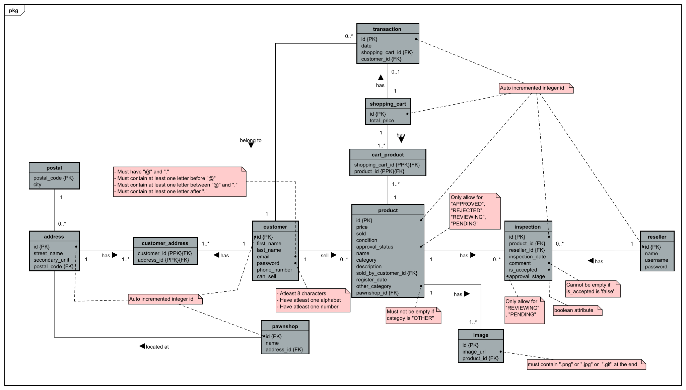

# ResPawn

> [!NOTE]
> **Project Continuation:** This repository is a personal project continuing from a third-semester university project (SEP3). The original was a multi-tier school assignment; this continuation evolves it into **production-grade infrastructure** — adding Kafka, Docker, Kubernetes, Azure PaaS, CI/CD with coverage gates, and enterprise security patterns.

---

### Table of Contents
- [Overview](#overview)
- [Architecture](#architecture)
- [Tech Stack](#tech-stack)
- [Security Implemented](#security-implemented)
- [Testing & CI/CD](#testing--cicd)
- [Running Locally](#running-locally)
- [Currently Working On](#currently-working-on--azure-paas--kubernetes)
- [Features](#features)
- [Analyses & Designs](#analyses--designs)
- [TLS/SSL Certificate Setup Guide](#tlsssl-certificate-setup-guide)

---

## Overview

ResPawn-Shichiya is an online pawn shop platform modeled after typical e-commerce and chat systems, adapted so users can submit items for sale and receive a purchase offer from the shop.

Demo on YouTube: https://youtu.be/FjboqOlDwV8 — Credits to [OliverX04](https://github.com/OliverX04) for the voice-over.

---

## Architecture

The system is decomposed into **four containerized microservices** that communicate over gRPC and an event bus:

```
[Blazor Frontend]
      |  HTTP (REST)
[.NET WebAPI]  ──── gRPC (TLS) ────  [Spring Boot gRPC Server]
      |                                        |
      |  Kafka Produce                  Kafka Produce/Consume
      |                                        |
[.NET Kafka Worker] ◄────────────────── [Apache Kafka / KRaft]
      |                                        |
    Email                              [PostgreSQL]
```

| Service | Tech | Role |
|---|---|---|
| `grpc-server-springboot-service` | Java 25 / Spring Boot 4 | gRPC server, JPA/Hibernate, Kafka producer |
| `grpc-client-dotnet-services` | .NET 10 / C# | REST API, gRPC client, JWT auth, Kafka producer |
| `blazor-frontend` | .NET 10 / Blazor | Web UI |
| `kafka-worker` | .NET 10 / C# | Background Kafka consumer — sends welcome emails via FluentEmail |

**Message flow example (registration):** WebAPI receives REST call → produces `welcomeEmail` Kafka event → Kafka Worker consumes → sends email via SMTP/Mailgun → commits offset. On failure: exponential backoff (Polly) → Dead Letter Topic (`welcomeEmail-dlt`).

---

## Tech Stack

### Backend
| Technology | Version | Purpose |
|---|---|---|
| Java / Spring Boot | 4.0.3 | gRPC server, REST endpoints, Spring Security, JPA |
| .NET / C# | 10.0 | WebAPI (gRPC client), Blazor frontend, Kafka worker |
| gRPC + Protocol Buffers | — | High-performance typed inter-service RPC |
| Apache Kafka (KRaft) | Confluent latest | Async event-driven messaging (no ZooKeeper) |
| PostgreSQL | latest | Relational database |
| Spring Data JPA / Hibernate | — | ORM for PostgreSQL |

### Infrastructure & Deployment
| Technology | Purpose |
|---|---|
| Docker / Docker Compose | Local multi-service orchestration |
| Kubernetes | Production container orchestration (manifests in `/k8s`) |
| GitHub Actions | CI/CD: automated build, test, coverage check, artifact upload |

### Security & Cloud
| Technology | Purpose |
|---|---|
| Azure Key Vault | Secrets & certificate management (no `.env` in production) |
| Azure Identity / `DefaultAzureCredential` | Passwordless auth to Azure services via Managed Identity |
| JWT Bearer (`Microsoft.AspNetCore.Authentication.JwtBearer`) | Stateless API authentication |
| TLS/SSL (PKCS12 / `.p12`) | Encrypted gRPC channel between .NET and Spring Boot |
| Spring Security | Java-layer HTTP and gRPC security |
| Polly | Resilience: retry with exponential backoff + Dead Letter Topic |

---

## Security Implemented

### 1. TLS/SSL — gRPC Transport Encryption
The gRPC channel between the .NET WebAPI (client) and Spring Boot (server) is encrypted end-to-end using **one-way TLS** with a PKCS12 certificate:
- **Spring Boot** loads the keystore via `spring.ssl.bundle.jks.sep3` bound to environment variables.
- **.NET WebAPI** configures Kestrel with the same `.p12` certificate via `PFX_FILE_PATH` / `PFX_PASSWORD`.
- In production: certificates are sourced from **Azure Key Vault** (`azure-spring-boot-starter-keyvault-certificates`) — no cert files on disk.

### 2. JWT Bearer Authentication
- All protected API endpoints require a valid JWT token.
- Tokens are validated against issuer, audience, signing key — all loaded from environment variables / Key Vault.
- Token can also be read from a cookie (custom `JwtBearerEvents` on the .NET side).

### 3. Spring Security (Java)
- HTTP Basic auth guards the Spring Boot management layer (`sep3admin` user, password from env).
- `spring-boot-starter-security` applied to REST and gRPC layers.

### 4. Azure Key Vault — Secrets Management
- **Java (Spring Boot):** `spring-cloud-azure-starter-keyvault` + `azure-spring-boot-starter-keyvault-certificates` inject secrets and certificates at startup via Azure Managed Identity — zero hardcoded credentials.
- **.NET (KafkaConsumer & WebAPI):** `Azure.Extensions.AspNetCore.Configuration.Secrets` + `Azure.Identity` (`DefaultAzureCredential`) pull secrets at runtime.
- Sensitive values (DB passwords, JWT keys, Kafka SASL passwords) **never appear in code or committed files**.

### 5. SASL/TLS for Azure Event Hubs (Kafka)
- When deployed to Azure, the Kafka worker switches from plaintext local Kafka to **SASL_SSL** against Azure Event Hubs — toggled purely via environment variables (`Kafka__SaslPassword`, `Kafka__SecurityProtocol`, `Kafka__SaslMechanism`).

### 6. Resilience — Dead Letter Topic
- The Kafka email consumer uses **Polly** with 3-attempt exponential backoff.
- Permanently failing messages are forwarded to `welcomeEmail-dlt` to prevent data loss without blocking the consumer.

### 7. Docker Security Hygiene
- Self-signed cert volumes are mounted **read-only** (`:ro`) in containers.
- Secrets are passed only as container environment variables — never baked into images.

---

## Testing & CI/CD

Three GitHub Actions workflows run on every push and pull request:

| Workflow | Trigger | What it does |
|---|---|---|
| `build-startup.yml` | All branches | Maven clean verify (compile + test + Jacoco coverage check) |
| `spring-boot-test.yml` | `main` branch | Maven verify + Jacoco HTML report upload |
| `dotnet-test.yml` | All branches (C# paths) | `dotnet test` with Coverlet + ReportGenerator |

**Coverage gates:**
- Java (Jacoco): **80% instruction coverage** enforced — build fails below threshold.
- .NET (Coverlet + ReportGenerator): **80% line coverage** enforced — build fails below threshold.
- Coverage HTML reports are uploaded as GitHub Actions artifacts on every run.

---

## Running Locally

### Prerequisites
- Docker Desktop
- `.env` file in the repo root (see [TLS/SSL Setup Guide](#tlsssl-certificate-setup-guide) for variables)

```bash
docker compose up --build
```

| Service | URL |
|---|---|
| Blazor Frontend | http://localhost:5195 |
| .NET WebAPI (HTTP) | http://localhost:6761 |
| .NET WebAPI (HTTPS) | https://localhost:6760 |
| Spring Boot REST | https://localhost:8080 |
| gRPC Server | https://localhost:6767 |
| Kafka broker | localhost:9092 |
| PostgreSQL | localhost:5432 |

---

## Currently Working On — Azure PaaS & Kubernetes

The local `docker-compose` stack is being migrated to a fully managed Azure cloud environment. The plan is documented in [`documents/my-note/production-deployment-plan.md`](documents/my-note/production-deployment-plan.md).

### Phase 1 — Managed Services (in progress)
- **Azure Database for PostgreSQL Flexible Server** — PaaS replacement for the local Postgres container; 100% wire-compatible with existing JPA/EF code.
- **Azure Event Hubs** (Kafka-compatible endpoint, port 9093) — PaaS replacement for the local KRaft container; consumer switches protocol via env vars only.
- **Azure Key Vault (`respawn-prod-kv`)** — already partially integrated in both Java and .NET; stores DB credentials, JWT keys, Kafka SASL passwords, and TLS certificates.

### Phase 2 — Code Refactoring for Key Vault Auth (in progress)
- Java: `spring-cloud-azure-starter-keyvault` + `azure-spring-boot-starter-keyvault-certificates` already added to `pom.xml`; Key Vault endpoint wired in `application.properties`.
- .NET: `Azure.Extensions.AspNetCore.Configuration.Secrets` + `Azure.Identity` already added to `KafkaConsumer.csproj`.

### Phase 3 — TLS Offloading
- Remove self-signed cert volume mounts from containers.
- Services communicate over plain HTTP **internally** within the Azure virtual network.
- Azure Ingress Controller (or Azure Container Apps built-in ingress) handles HTTPS termination at the edge using a managed certificate.

### Phase 4 — Container Registry & Deployment
- **Azure Container Registry (ACR)** — GitHub Actions will build all four Dockerfiles and push images on merge to `main`.
- **Azure Container Apps (ACA)** — Serverless equivalent of `docker-compose` in the cloud:
  - System-Assigned Managed Identity on each Container App.
  - RBAC: `Key Vault Secrets User` role granted to each identity.
  - Internal DNS routing between services (no public IPs between microservices).

### Kubernetes (k8s/)
Kubernetes manifests are drafted in `/k8s` for cases where AKS is preferred over Container Apps:
- `java-t3-deployment.yaml` + `java-t3-service.yaml` — Spring Boot (2 replicas)
- `csharp-t2-deployment.yaml` + `csharp-t2-service.yaml` — .NET WebAPI
- `kafka-statefulset.yaml` — Kafka StatefulSet
- `postgres-statefulset.yaml` — PostgreSQL StatefulSet
- `kustomization.yaml` — Kustomize overlay pulling config/secrets from `.env`

---

## Features

- Customer Registration & Login
- Reseller Login
- Product/Item Upload
- Product/Item Inspection & Purchase
- Customer Profile (Get / Update)
- Address Lookup
- Welcome Email on Registration (async, event-driven via Kafka)

---

## Working Process
- **UP (Unified Process)**
- **Kanban board:** [TeamHood](https://mrpdodaschool.teamhood.com/PHCAWO/Board/SPRNTS?view=KANBAN&token=Ym9hcmRWaWV3OzAxNjZkZTA3NGFlNzQ4M2Y4NGJlZjAzYTg4ZGEwY2Zl)

---

## Analyses & Designs

### Activity Diagram example (login) — [all diagrams](documents/analyses/activity_diagrams)


### System Sequence Diagram (SSD) example (login) — [all diagrams](documents/analyses/ssds)


### Domain Model


### Entity Relationship Diagram (EER)


### Global Relations Diagram (GR)


---

## TLS/SSL Certificate Setup Guide

### Overview
This project uses TLS/SSL to secure communication between:
- **Java gRPC Server** (port 6767): PKCS12 keystore for TLS encryption
- **C# WebAPI** (port 6760): One-way TLS handshake with the gRPC server using the same certificate

---

### Development (Self-Signed Certificate)

#### Configuration — Java gRPC Server
`java_projects/ResPawn/src/main/resources/application.properties`:
```properties
spring.grpc.server.ssl.secure=true
spring.grpc.server.ssl.bundle=sep3
spring.ssl.bundle.jks.sep3.keystore.location=${KEYSTORE_LOCATION}
spring.ssl.bundle.jks.sep3.keystore.password=${KEYSTORE_PASSWORD}
spring.ssl.bundle.jks.sep3.keystore.type=PKCS12
spring.ssl.bundle.jks.sep3.key.password=${KEY_PASSWORD}
```

#### Configuration — C# WebAPI
`C_sharp/Server/WebAPI/Program.cs`:
```csharp
builder.WebHost.ConfigureKestrel(options =>
{
    options.ListenLocalhost(6760, lo =>
    {
        lo.UseHttps(pfxFilePath, pfxPassword);
    });
});
```

#### Environment Variables

**Root `.env`** (Docker Compose reads this):
```env
POSTGRES_DB=respawn_db
DB_USERNAME=your_db_user
DB_PASSWORD=your_db_password
DOCKER_DB_URL=jdbc:postgresql://portgres_respawn:5432/respawn_db
RELATIVE_KEY_PATH=/app/self_signed_certs/your_cert.p12
KEY_PASSWORD=your_keystore_password
PFX_FILE_PATH=/app/self_signed_certs/your_cert.p12
PFX_PASSWORD=your_keystore_password
JWT__KEY=your_long_jwt_signing_key
JWT__ISSUER=your_issuer
JWT__AUDIENCE=your_audience
JWT__SUBJECT=your_subject
KAFKA__BOOTSTRAPSERVERS=respawn_kafka:29092
```

**Java local `.env`** (`java_projects/ResPawnMarket/.env`):
```env
DB_URL=jdbc:postgresql://localhost:5432/respawn_db
DB_USERNAME=your_db_user
DB_PASSWORD=your_db_password
DB_DRIVER=org.postgresql.Driver
KEYSTORE_LOCATION=/path/to/your/cert.p12
KEYSTORE_PASSWORD=your_keystore_password
KEY_PASSWORD=your_keystore_password
IS_SSL_ENABLED=true
```

**C# local `.env`** (`C_sharp/Server/WebAPI/.env`):
```env
PFX_FILE_PATH=/path/to/your/cert.p12
PFX_PASSWORD=your_keystore_password
JWT__KEY=your_custom_long_string_jwt_key
JWT__Issuer=your_custom_jwt_issuer
JWT__Audience=your_custom_jwt_audience
JWT__Subject=your_custom_jwt_subject
```

---

### Production (Azure Key Vault)

Certificates and secrets are sourced from **Azure Key Vault** — no `.env` files or cert files are deployed to production containers.

- **Java:** `spring.cloud.azure.keyvault.secret.endpoint=https://respawn-prod-kv.vault.azure.net/`
- **.NET:** `Azure.Extensions.AspNetCore.Configuration.Secrets` + `DefaultAzureCredential` (Managed Identity)

> See [`documents/my-note/production-deployment-plan.md`](documents/my-note/production-deployment-plan.md) for the full migration plan.
