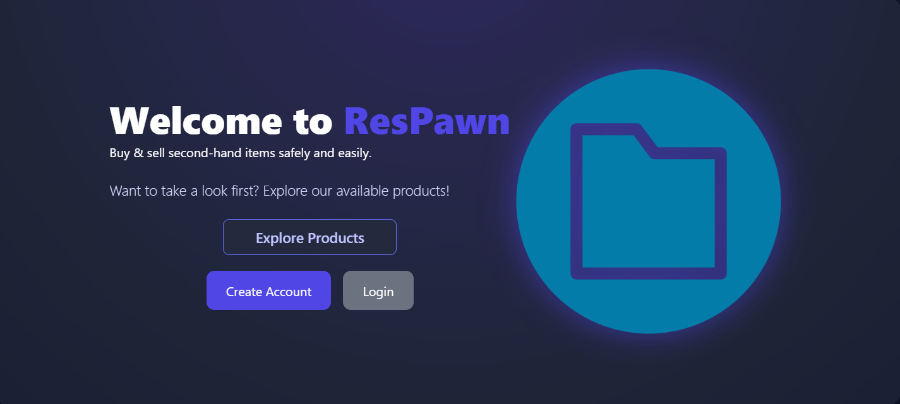
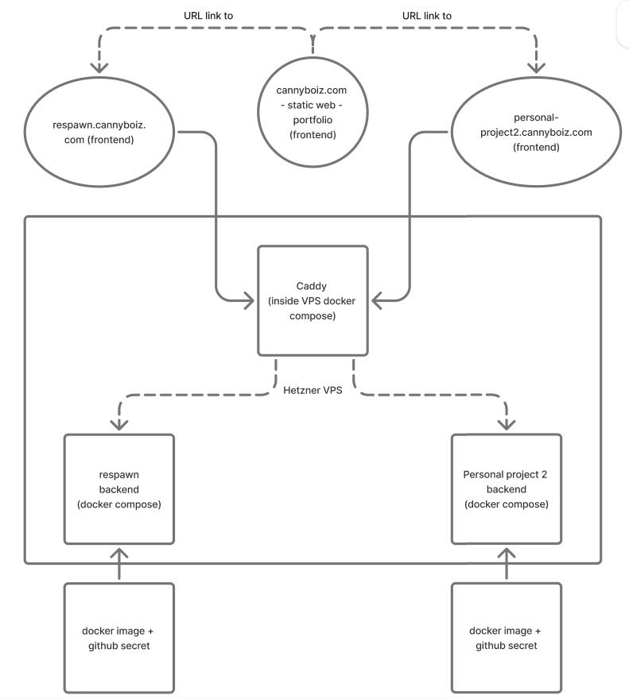
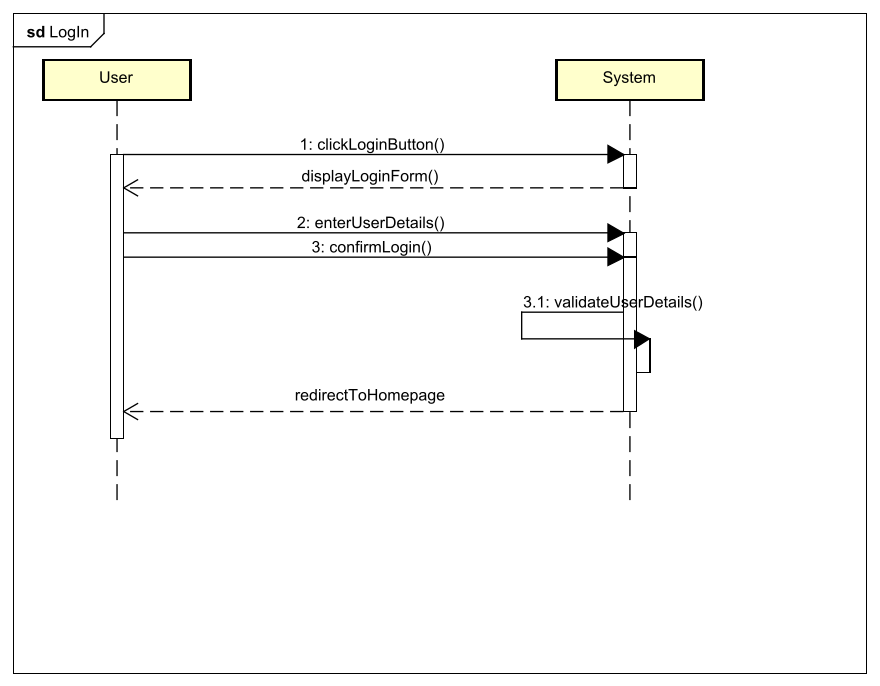
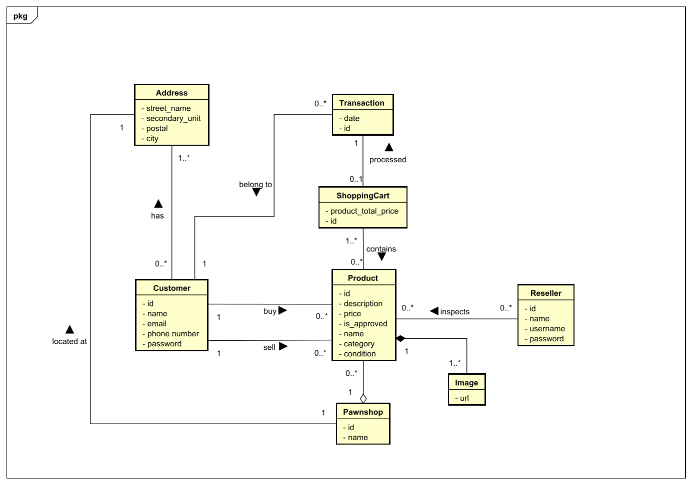
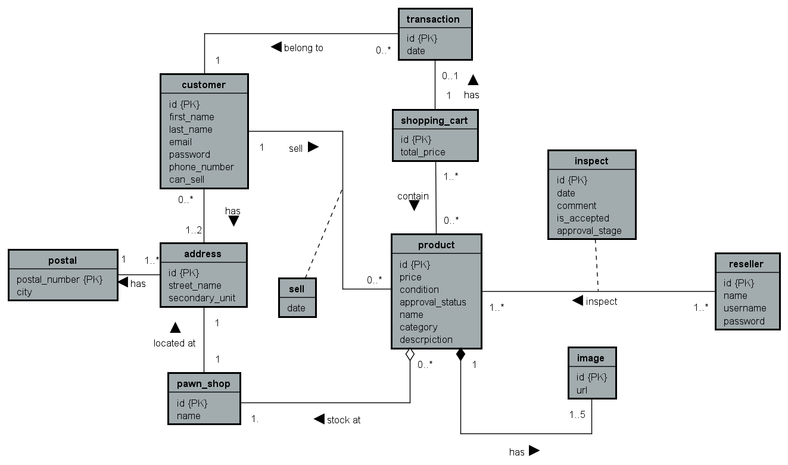
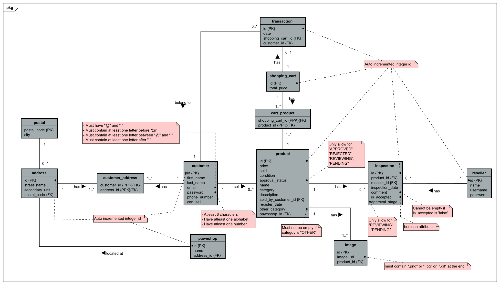

# ResPawn

> **Project Continuation:** This repository is a personal project continuing from a third-semester university project (SEP3). The original was a multi-tier school assignment; this continuation evolves it into **production-grade infrastructure** — adding RabbitMQ, MassTransit, Docker, CI/CD with coverage gates, and enterprise security patterns. Production runs on a Hetzner VPS with `docker-compose`.



Demo on YouTube: https://youtu.be/FjboqOlDwV8 — Credits to [OliverX04](https://github.com/OliverX04) for the voice-over.

---

### Table of Contents
- [Overview](#overview)
- [Architecture](#architecture)
- [VPS Infrastructure](#vps-infrastructure)
- [Tech Stack](#tech-stack)
- [Security — Local vs Production](#security--local-vs-production)
- [Testing & CI/CD](#testing--cicd)
- [Running Locally](#running-locally)
- [Production Deployment — Hetzner VPS](#production-deployment--hetzner-vps)
- [Admin Setup — Reseller Accounts](#admin-setup--reseller-accounts)
- [Previously Planned (Azure — Cancelled)](#previously-planned--azure-paas--kubernetes--cancelled)
- [Features](#features)
- [Analyses & Designs](#analyses--designs)
- [TLS/SSL Certificate Setup Guide](#tlsssl-certificate-setup-guide)

---

## Overview

ResPawn-Shichiya is an online pawn shop platform modeled after typical e-commerce and chat systems, adapted so users can submit items for sale and receive a purchase offer from the shop.

---

## Architecture

The system is decomposed into **five containerized services** that communicate over gRPC and RabbitMQ:

```
[React Frontend]  (Cloudflare Pages)
      |  HTTPS (REST)
[.NET WebAPI]  ──── gRPC (TLS) ────  [Spring Boot gRPC Server]
                                              |
                                       RabbitMQ Produce
                                              |
[.NET Message Worker] ◄──────────────── [RabbitMQ]
      |                                        |
    Email (SMTP)                       [PostgreSQL]
```

| Service | Tech | Role |
|---|---|---|
| `grpc-server-springboot-service` | Java 25 / Spring Boot 4 | gRPC server, JPA/Hibernate, RabbitMQ producer (Spring AMQP) |
| `grpc-client-dotnet-services` | .NET 10 / C# | REST API, gRPC client, JWT auth |
| `message-worker` | .NET 10 / C# | MassTransit RabbitMQ consumer — sends welcome emails via FluentEmail |
| `rabbitmq` | RabbitMQ | Message broker with fanout exchanges |
| `postgres` | PostgreSQL | Relational database |

**Message flow example (registration):** WebAPI receives REST call → gRPC to Spring Boot → publishes `WelcomeEmailDto` as JSON to RabbitMQ `welcomeEmail` fanout exchange → MassTransit consumer picks up → sends email via SMTP/Mailgun. On failure: MassTransit exponential backoff (5 retries) → message moved to `welcomeEmail_error` queue.

---

## VPS Infrastructure



The Hetzner VPS hosts multiple projects behind a shared **Caddy** reverse proxy:

| Component | Role |
|---|---|
| **Caddy** | Reverse proxy with automatic Let's Encrypt TLS. Routes subdomains to Docker containers via `caddy_net` network |
| **ResPawn backend** | 5-service Docker Compose stack (WebAPI, gRPC server, RabbitMQ, PostgreSQL, message worker) |
| **Cloudflare Pages** | Hosts the React frontend (`respawn.cannyboiz.com`), calls API at `api-respawn.cannyboiz.com` |
| **GitHub Actions** | Builds Docker images → pushes to GHCR → SCPs compose files to VPS → pulls and restarts |

**Traffic flow:**
```
User → respawn.cannyboiz.com (Cloudflare Pages)
         → HTTPS API calls →
User → api-respawn.cannyboiz.com (Cloudflare DNS → VPS)
         → Caddy (TLS termination) →
         → caddy_net Docker network →
         → respawn-grpc-client:6760 (WebAPI container)
```

---

## Tech Stack

### Backend
| Technology | Version | Purpose |
|---|---|---|
| Java / Spring Boot | 4.0.3 | gRPC server, REST endpoints, Spring Security, JPA |
| .NET / C# | 10.0 | WebAPI (gRPC client), message worker |
| gRPC + Protocol Buffers | — | High-performance typed inter-service RPC |
| RabbitMQ | latest | Async event-driven messaging with fanout exchanges |
| Spring AMQP | — | RabbitMQ producer on the Java side (Jackson JSON serialization) |
| MassTransit | 8.4 | RabbitMQ consumer transport abstraction on the C# side |
| PostgreSQL | latest | Relational database |
| Spring Data JPA / Hibernate | — | ORM for PostgreSQL |

### Frontend
| Technology | Version | Purpose |
|---|---|---|
| React | 19 | Primary web UI (deployed on Cloudflare Pages) |
| Vite | 8.0 | Build tooling and dev server |
| Blazor | .NET 10 | Legacy web UI (inactive, kept for reference) |

### Infrastructure & Deployment
| Technology | Purpose |
|---|---|
| Docker / Docker Compose | Local development & production deployment |
| Hetzner VPS | Production hosting (docker-compose with prod override) |
| Caddy | Reverse proxy with automatic Let's Encrypt TLS |
| Cloudflare Pages | Frontend hosting with CDN |
| GitHub Actions | CI/CD: build → test → Docker push → SCP deploy |
| GHCR | Container image registry (GitHub Container Registry) |
| Kubernetes (minikube) | Local k8s demo/learning only (manifests in `/k8s`) |

### Security
| Technology | Purpose |
|---|---|
| Environment variables (`.env.prod`) | Production secrets management (DB, JWT, RabbitMQ, SMTP) |
| JWT Bearer (`Microsoft.AspNetCore.Authentication.JwtBearer`) | Stateless API authentication (HTTP-only cookie transport) |
| TLS/SSL (PKCS12 / `.p12`) | Encrypted gRPC channel between .NET and Spring Boot |
| Spring Security | Java-layer HTTP and gRPC security |
| Caddy + Let's Encrypt | Automatic HTTPS for public-facing API |
| BCrypt | One-way password hashing for customers and resellers |
| MassTransit retry + error queues | Resilience: exponential backoff with automatic error queue routing |

---

## Security — Local vs Production

Documenting the security posture differences between local development and production deployment. No secrets are revealed — only architectural patterns.

### Network Exposure

| Concern | Local Development | Production (VPS) |
|---|---|---|
| **Port binding** | All ports on `0.0.0.0` (host-accessible) | `ports: !reset []` — no ports bound to host |
| **Service discovery** | Direct `localhost:PORT` access | Internal Docker DNS only (`expose:` directive) |
| **Public access** | All services reachable from host machine | Only WebAPI reachable, via Caddy reverse proxy on `caddy_net` |
| **TLS (public)** | Self-signed cert or HTTP | Caddy auto-provisions Let's Encrypt certificates |
| **TLS (gRPC)** | Self-signed `.p12` certificate | Same `.p12` cert (internal traffic, not internet-facing) |

### Credential Management

| Concern | Local Development | Production (VPS) |
|---|---|---|
| **RabbitMQ** | `guest` / `guest` (default) | Unique credentials via GitHub Secrets → `.env.prod` |
| **PostgreSQL** | Simple dev password in `.env` | Strong password via GitHub Secrets → `.env.prod` |
| **JWT signing key** | Short dev key in `.env` | 32+ char random key via GitHub Secrets |
| **Secret storage** | `.env` file (gitignored) | `.env.prod` generated at deploy time by CI/CD, never committed |
| **Secret delivery** | Manual, file-based | GitHub Secrets → SSH action → `printf` to `.env.prod` on VPS |

### Docker Compose Override Strategy

The same `docker-compose.yml` is used everywhere. Production differences are applied via `docker-compose.prod.yml`:

```yaml
# Production override removes ALL host port bindings
rabbitmq:
  ports: !reset []          # Was: 5672:5672, 15672:15672

postgres:
  ports: !reset []          # Was: 5432:5432

grpc-server-springboot-service:
  ports: !reset []          # Was: 8080:8080, 6767:6767
  expose:
    - "6767"                # Internal only

grpc-client-dotnet-services:
  ports: !reset []          # Was: 6760:6760, 6761:6761
  expose:
    - "6760"                # Reachable only via caddy_net
  networks:
    - default
    - caddy_net             # Connection to Caddy reverse proxy
```

### Deployment Security

| Concern | Before (Initial Setup) | After (Current) |
|---|---|---|
| **Code delivery to VPS** | `git clone` + `git pull` (full repo history on VPS, git credentials needed) | `appleboy/scp-action` copies only 4 files (compose files + scripts). No git on VPS |
| **Image delivery** | `docker compose build` on VPS (source code on VPS) | Pre-built images pulled from GHCR. No source code on VPS |
| **VPS footprint** | Full repository clone | Minimal: 2 compose files + 2 scripts + `.env.prod` |
| **Cookie security** | `SameSite=Strict`, no `Domain` | `SameSite=None`, `Secure=true`, `Domain=.cannyboiz.com` (cross-subdomain auth) |

---

## Testing & CI/CD

A single GitHub Actions workflow (`ci-cd.yml`) runs a **4-stage pipeline** on every push:

### Stage 1 — Build & Test (parallel)
| Job | What it does |
|---|---|
| `spring-boot-test` | Maven clean verify + Jacoco coverage check |
| `dotnet-test` | MessageConsumer tests + Coverlet coverage report |
| `dotnet-build-webapi` | WebAPI build verification |
| `dotnet-build-blazor` | BlazorApp build verification |
| `react-build` | Node 20 lint + Vite build |

### Stage 2 — Integration Tests
- Spins up full backend stack (PostgreSQL, RabbitMQ, gRPC server, WebAPI) via Docker Compose
- Waits for WebAPI health check (`/api/products`)
- Runs React integration tests (`npm run test:integration`)

### Stage 3 — Docker Image Build & Push (main branch only)
- Builds 3 Docker images and pushes to GHCR:
  - `respawn-grpc-server` (Java)
  - `respawn-grpc-client` (.NET WebAPI)
  - `respawn-message-worker` (.NET MessageConsumer)
- Tags: `:latest` + `:${GIT_SHA}`

### Stage 4 — Deploy to VPS (main branch only)
- SCPs compose files and scripts to VPS
- Generates `.env.prod` from GitHub Secrets
- Pulls pre-built images from GHCR
- Runs `docker compose up -d`

**Coverage gates:**
- Java (Jacoco): **80% instruction coverage** — build fails below threshold.
- .NET (Coverlet + ReportGenerator): **50% line coverage** — build fails below threshold.
- Coverage HTML reports are uploaded as GitHub Actions artifacts on every run.

---

## Running Locally

### Prerequisites
- Docker Desktop
- `.env` file in the repo root (see [TLS/SSL Setup Guide](#tlsssl-certificate-setup-guide) for variables)

```bash
docker compose up --build
```

| Service | URL |
|---|---|
| .NET WebAPI (HTTPS) | https://localhost:6760 |
| .NET WebAPI (HTTP) | http://localhost:6761 |
| Spring Boot REST | https://localhost:8080 |
| gRPC Server | https://localhost:6767 |
| RabbitMQ broker | localhost:5672 |
| RabbitMQ Management UI | http://localhost:15672 |
| PostgreSQL | localhost:5432 |

### React Frontend (separate)
```bash
cd react-frontend
npm install
npm run dev
```
Set `VITE_API_BASE_URL=http://localhost:6760` in `react-frontend/.env` for local API calls.

---

## Production Deployment — Hetzner VPS

Production runs on a **Hetzner VPS** using `docker-compose` with a production override file. Deployment is fully automated via GitHub Actions on push to `main`.

### How It Works

1. **CI/CD builds** Docker images and pushes to GHCR
2. **SCP** copies `docker-compose.yml`, `docker-compose.prod.yml`, `scripts/init.sql`, and `scripts/create-reseller.sh` to `/opt/ResPawn` on the VPS
3. **SSH action** generates `.env.prod` from GitHub Secrets, pulls images, and starts services

### VPS One-Time Setup
```bash
mkdir -p /opt/ResPawn/scripts
docker network create caddy_net
```

### Manual Deploy (if needed)
```bash
cd /opt/ResPawn
docker compose -f docker-compose.yml -f docker-compose.prod.yml --env-file .env.prod pull
docker compose -f docker-compose.yml -f docker-compose.prod.yml --env-file .env.prod up -d
```

### Production Stack
| Component | Solution |
|---|---|
| Hosting | Hetzner VPS |
| Reverse Proxy | Caddy (automatic Let's Encrypt TLS) |
| Frontend | Cloudflare Pages |
| Message Broker | RabbitMQ (self-hosted in Docker) |
| Database | PostgreSQL (self-hosted in Docker) |
| Image Registry | GHCR (GitHub Container Registry) |
| Secrets | `.env.prod` generated by CI/CD from GitHub Secrets |

### Kubernetes (k8s/ — Local Only)
Kubernetes manifests in `/k8s` are kept for **local development with minikube** to demonstrate how services would run in a k8s environment:
- `java-t3-deployment.yaml` + `java-t3-service.yaml` — Spring Boot
- `csharp-t2-deployment.yaml` + `csharp-t2-service.yaml` — .NET WebAPI
- `postgres-statefulset.yaml` — PostgreSQL StatefulSet
- `kustomization.yaml` — Kustomize overlay pulling config/secrets from `.env`

---

## Admin Setup — Reseller Accounts

Reseller accounts have no public registration endpoint (by design — only customers can self-register). Resellers are created administratively.

### First Reseller (Automatic Seed)

On first startup, if the `reseller` table is empty, the Spring Boot server automatically creates one reseller from environment variables:

| Variable | Purpose |
|---|---|
| `SEED_RESELLER_NAME` | Display name for the reseller |
| `SEED_RESELLER_USERNAME` | Login username |
| `SEED_RESELLER_PASSWORD` | Plain-text password (hashed with BCrypt at runtime) |

Set these in your `.env` (local) or as GitHub Secrets (production). The seeder is **idempotent** — it skips if any reseller already exists, so container restarts are safe.

### Additional Resellers

To create more resellers on a running instance, use the provided script from the VPS (requires SSH access):

```bash
./scripts/create-reseller.sh "Reseller Name" "username" "password"
```

**Prerequisites:** `python3` with `bcrypt` installed on the machine running the script (`pip install bcrypt`).

The script hashes the password with BCrypt and inserts via `docker exec` into PostgreSQL. No ports are exposed — this only works with direct access to the Docker host.

---

## Previously Planned — Azure PaaS & Kubernetes (Cancelled)

> **Cancelled (April 2026):** The Azure cloud migration was abandoned due to cost. Running AKS, ACR, Key Vault, and Event Hubs/Confluent Cloud together was not cost-effective for this project. All Azure resources have been deleted. Production now uses a Hetzner VPS with docker-compose (see above).

<details>
<summary>Original Azure migration plan (for reference)</summary>

~~The local `docker-compose` stack was being migrated to a fully managed Azure cloud environment.~~

~~**Phase 1 — Managed Services:**
Azure Database for PostgreSQL Flexible Server, Azure Event Hubs (Kafka-compatible), Azure Key Vault for secrets & certificates.~~

~~**Phase 2 — Code Refactoring for Key Vault Auth:**
Java `spring-cloud-azure-starter-keyvault` and .NET `Azure.Extensions.AspNetCore.Configuration.Secrets` + `Azure.Identity` for passwordless auth via Managed Identity.~~

~~**Phase 3 — TLS Offloading:**
Remove self-signed certs from containers; Azure Ingress Controller handles HTTPS termination.~~

~~**Phase 4 — Container Registry & Deployment:**
Azure Container Registry (ACR) for images, Azure Container Apps (ACA) or AKS for orchestration with Managed Identity RBAC.~~

~~**AKS-specific manifests** (Workload Identity, SecretProviderClass for Key Vault CSI driver) were drafted in `k8s/aks/` but have been deleted.~~

</details>

---

## Features

- Customer Registration & Login
- Reseller Login
- Product/Item Upload with images (max 5 per product)
- Product Inspection & Approval workflow (PENDING → REVIEWING → APPROVED/REJECTED)
- Product Purchase with shopping cart
- Customer Profile (Get / Update)
- Address Lookup
- Welcome Email on Registration (async, event-driven via RabbitMQ + MassTransit)

---

## Working Process
- **UP (Unified Process)**
- **Kanban board:** [TeamHood](https://mrpdodaschool.teamhood.com/PHCAWO/Board/SPRNTS?view=KANBAN&token=Ym9hcmRWaWV3OzAxNjZkZTA3NGFlNzQ4M2Y4NGJlZjAzYTg4ZGEwY2Zl)

---

## Analyses & Designs

### Activity Diagram example (login) — [all diagrams](documents/analyses/activity_diagrams)


### System Sequence Diagram (SSD) example (login) — [all diagrams](documents/analyses/ssds)


### Domain Model


### Entity Relationship Diagram (EER)


### Global Relations Diagram (GR)


---

## TLS/SSL Certificate Setup Guide

### Overview
This project uses TLS/SSL to secure communication between:
- **Java gRPC Server** (port 6767): PKCS12 keystore for TLS encryption
- **C# WebAPI** (port 6760): One-way TLS handshake with the gRPC server using the same certificate

---

### Development (Self-Signed Certificate)

#### Configuration — Java gRPC Server
`java_projects/ResPawn/src/main/resources/application.properties`:
```properties
spring.grpc.server.ssl.secure=true
spring.grpc.server.ssl.bundle=sep3
spring.ssl.bundle.jks.sep3.keystore.location=${KEYSTORE_LOCATION}
spring.ssl.bundle.jks.sep3.keystore.password=${KEYSTORE_PASSWORD}
spring.ssl.bundle.jks.sep3.keystore.type=PKCS12
spring.ssl.bundle.jks.sep3.key.password=${KEY_PASSWORD}
```

#### Configuration — C# WebAPI
`C_sharp/Server/WebAPI/Program.cs`:
```csharp
builder.WebHost.ConfigureKestrel(options =>
{
    options.ListenLocalhost(6760, lo =>
    {
        lo.UseHttps(pfxFilePath, pfxPassword);
    });
});
```

#### Environment Variables

**Root `.env`** (Docker Compose reads this):
```env
POSTGRES_DB=respawn_db
DB_USERNAME=your_db_user
DB_PASSWORD=your_db_password
DOCKER_DB_URL=jdbc:postgresql://portgres_respawn:5432/respawn_db
RELATIVE_KEY_PATH=/app/self_signed_certs/your_cert.p12
KEY_PASSWORD=your_keystore_password
PFX_FILE_PATH=/app/self_signed_certs/your_cert.p12
PFX_PASSWORD=your_keystore_password
JWT__KEY=your_long_jwt_signing_key
JWT__ISSUER=your_issuer
JWT__AUDIENCE=your_audience
JWT__SUBJECT=your_subject
SPRING_RABBITMQ_HOST=respawn_rabbitmq
SPRING_RABBITMQ_PORT=5672
SPRING_RABBITMQ_USERNAME=guest
SPRING_RABBITMQ_PASSWORD=guest
```

**Java local `.env`** (`java_projects/ResPawnMarket/.env`):
```env
DB_URL=jdbc:postgresql://localhost:5432/respawn_db
DB_USERNAME=your_db_user
DB_PASSWORD=your_db_password
DB_DRIVER=org.postgresql.Driver
KEYSTORE_LOCATION=/path/to/your/cert.p12
KEYSTORE_PASSWORD=your_keystore_password
KEY_PASSWORD=your_keystore_password
IS_SSL_ENABLED=true
```

**C# local `.env`** (`C_sharp/Server/WebAPI/.env`):
```env
PFX_FILE_PATH=/path/to/your/cert.p12
PFX_PASSWORD=your_keystore_password
JWT__KEY=your_custom_long_string_jwt_key
JWT__Issuer=your_custom_jwt_issuer
JWT__Audience=your_custom_jwt_audience
JWT__Subject=your_custom_jwt_subject
```

---

### Production (Hetzner VPS)

Secrets are managed via a `.env.prod` file on the VPS, generated automatically by CI/CD from GitHub Secrets. The production override `docker-compose.prod.yml` sets all services to Production mode with production credentials.

```bash
# Manual deploy (if needed):
docker compose -f docker-compose.yml -f docker-compose.prod.yml --env-file .env.prod pull
docker compose -f docker-compose.yml -f docker-compose.prod.yml --env-file .env.prod up -d
```

> See `.env.prod.example` for the full list of required environment variables.
